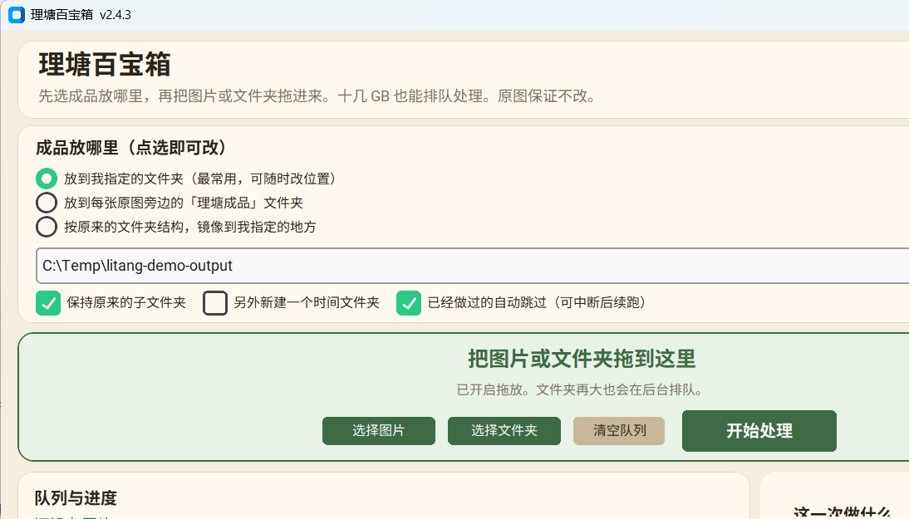

# 理塘百宝箱

本地图像后处理工具，提供批量超分、敏感区域打码和 PNG 元数据清理。Windows 源码与一键包面向大批量队列；Release 还提供一个历史 Android arm64 安装包。

[v2.4.4 Release](https://github.com/h1neolzr7f/litang-baibaoxiang/releases/tag/v2.4.4) · [产品说明](docs/PRODUCT.md) · [参与贡献](CONTRIBUTING.md) · [第三方组件](THIRD_PARTY.md)



> 截图由本仓库当前源码在隔离环境中启动后采集，输出位置使用 `C:\Temp\litang-demo-output` 演示路径；没有导入私人图片。

## 能力范围

| 能力 | Windows 源码 | Android Release |
| --- | :---: | :---: |
| 图片/文件夹队列与断点跳过 | 是 | 适合单张或小批量 |
| 像素、模糊等打码 | 是，需要检测运行时 | 是，APK 内机内 ONNX |
| Real-CUGAN 2/3/4 倍超分 | 是，需要外部运行时 | 否 |
| PNG 元数据清理 | 是 | 是 |
| 保留目录结构与输出预检 | 是 | 否 |

程序写入新的输出文件，不应修改原图。自动检测不能保证完整覆盖，发布或上传前仍需人工复核。

## Windows 一键包

普通用户优先下载 Release 里的 `理塘百宝箱-Windows-v2.4.4.zip`：完整解压后双击「启动理塘百宝箱.bat」即可，不需要自行安装 Python、ANR 或 Real-CUGAN。

这个 ZIP 由 GitHub Actions 自动构建：从上一版已发布的一键包复用第三方运行时和模型，只替换为当前标签对应的仓库源码，然后校验内置 Python、GUI、打码插件、检测权重和 Real-CUGAN 是否齐全。这样发布包和源码版本不会再靠人工同步。

## Windows 源码运行

```bat
git clone https://github.com/h1neolzr7f/litang-baibaoxiang.git
cd litang-baibaoxiang
python -m venv .venv
.venv\Scripts\pip.exe install -r requirements.txt pytest
.venv\Scripts\python.exe -m app
```

GUI、队列、输出规划、元数据处理与几何打码逻辑可以直接运行。完整的自动识别和超分还依赖仓库外的 ANR/YOLO/Real-CUGAN 运行时与模型；这些权重和可执行文件不在 git 中。

## 测试

```bat
.venv\Scripts\python.exe -m pytest -q tests --ignore=tests/test_anr_smoke.py
```

当前 CI 结果为 **58 passed, 2 skipped**。两个 skip 都是托管 Windows 环境相关：一个是缺少完整 Tk runtime 时跳过真实窗口可见性测试，另一个是仅适用于 POSIX 的假 NCNN 可执行文件测试。`test_anr_smoke.py` 仍需要外部 ANR 环境，未计入离线仓库验证。范围和命令见 [docs/VALIDATION.md](docs/VALIDATION.md)。

## Release 与可复现性

- Windows v2.4.4 一键包由 GitHub Actions 基于上一版已发布完整运行时自动刷新并校验；使用时请从 Release 下载完整 ZIP。开发机仍可用 `打包一键包.bat` 从本机 ANR 环境生成完整包。
- Android v0.29 APK 发布在同一 Release，但历史 Android Java 工程和模型权重不在本仓库。当前仓库因此**不能从源码复现该 APK**；[android/README.md](android/README.md) 仅记录安装与行为。
- APK、模型、签名密钥和大型运行时应继续放在 Release 或各自上游，不应提交到 git。

这一区分有助于贡献者判断哪些功能可以从当前源码验证，哪些仍依赖维护者的外部发布环境。

## 数据与安全

- 不要在 Issue 中上传待处理原图、模型、绝对路径或私人输出目录。
- 打码结果不是内容审核或法律意义上的保证。
- 从第三方取得的模型和运行时应核对来源、校验值与许可证。

## 许可证

仓库源码按 [AGPL-3.0](LICENSE) 发布。PyTorch、Ultralytics、ONNX Runtime、Real-CUGAN、模型权重和 Android APK 中的组件仍使用各自许可证，详见 [THIRD_PARTY.md](THIRD_PARTY.md)。
